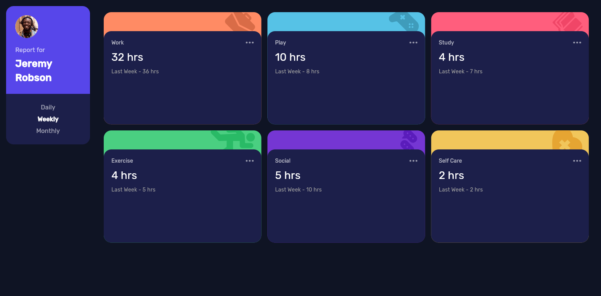

# Time Tracking Dashboard 🕒📊

A clean and responsive Flutter dashboard that helps users track how much time they spend on different activities like work, study, or play. You can view your time by day, week, or month — all using a smooth UI inspired by a Frontend Mentor challenge.

This project is a great example of working with Flutter layouts, local JSON data, and responsive design that works on mobile and desktop.

---

## Table of Contents
- [Overview](#overview)
  - [Screenshots](#screenshots)
  - [Features](#features)
  - [Links](#links)
- [How It Works](#how-it-works)
  - [Structure](#structure)
  - [Technologies Used](#technologies-used)
- [My Process](#my-process)
  - [Challenges](#challenges)
  - [What I Learned](#what-i-learned)
- [Author](#author)
- [Acknowledgments](#acknowledgments)

---

## Overview

### Screenshots

#### Dashboard – Mobile View

#### Dashboard – Desktop View

---

### Features
- Switch between **daily**, **weekly**, and **monthly** time reports.
- Edit hours spent on activities like Work, Exercise, Social, etc.
- Clean, card-based design that adapts to screen size.
- Built using only Flutter and local data.

---

### Links
- **GitHub Repository**: [Time Tracking Dashboard](https://github.com/fernandojosecc/time_tracking_dashboard)
- **Live Demo**: [View it Online](https://fernandojosecc.github.io/time_tracking_dashboard/)

---

## How It Works

### Technologies Used
- **Flutter** for building the UI
- **Dart** as the main programming language
- **JSON** to store and read activity data
- **MediaQuery** and layout widgets for responsiveness

---

## My Process

### Challenges
- Making sure the layout looks good on both small and large screens.
- Dynamically loading different time frames from JSON.
- Keeping the UI clean and user-friendly while showing useful data.

### What I Learned
- Improved how I work with layout and responsiveness in Flutter.
- Got more comfortable using data from JSON files.
- Learned how to build components that are easy to reuse and maintain.

---

## Author
- Frontend Mentor Profile: [@fernandojosecc](https://www.frontendmentor.io/profile/fernandojosecc)
- LinkedIn: [Fernando Contreras](https://www.linkedin.com/in/fernandojosecontreras/)
- GitHub: [@fernandojosecc](https://github.com/fernandojosecc)

---

## Acknowledgments
- Thanks to [Frontend Mentor](https://www.frontendmentor.io/) for the design challenge idea.
- Built with ❤️ and Flutter.

---
